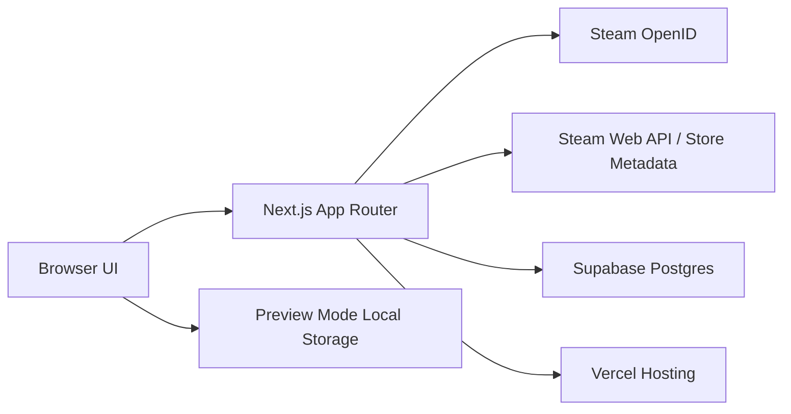

# Vault Shuffle

[Vault Shuffle](https://www.vaultshuffle.com) is a Steam backlog companion that helps players stop staring at a huge library and actually choose something to play.

It started as a first-year Python backlog tracker and has grown into a hosted Next.js app with Steam sign-in, Supabase persistence, Steam metadata sync, and a purpose-built shuffle flow.

## What It Does

- Lets visitors preview the app before signing in.
- Uses Steam OpenID so users can connect without sharing a Steam password.
- Imports a Steam library with playtime, last-played dates, artwork, genres, and ratings where available.
- Stores user-specific game state in Supabase: library source, progress, notes, completion, and shuffle-ready metadata.
- Lets users add individual games from Steam search.
- Filters by status, library source, top-level genre, length, and free-text search.
- Draws random unfinished games from the current visible list through the Vault Shuffle flow.
- Persists the selected visual theme across the site.

## Live Project

- Production: [vaultshuffle.com](https://www.vaultshuffle.com)
- Hosting: Vercel
- Database: Supabase Postgres
- Source control: GitHub

## Architecture



## Data Model

The main hosted data lives in Supabase:

- `app_users`: Steam identity, display name, avatar, and account timestamps.
- `games`: imported or manually added games with Steam AppID, title, artwork URLs, genres, rating, playtime, status, progress, ownership, and notes.
- `sessions`: server-side session records used by the HTTP-only auth cookie.
- `recommendations`: shuffle/recommendation history for future tuning.
- `steam_app_metadata`: cached Steam store metadata so imports do not repeatedly hammer Steam.

Preview mode is deliberately separate: guest games stay in browser storage and are not written to Supabase.

## Notable Implementation Details

- **Steam-first identity:** Steam confirms the account; Vault Shuffle never sees Steam passwords.
- **Metadata caching:** Steam app details are cached and refreshed in batches to avoid unnecessary API usage.
- **Top-level genre filters:** Games can keep detailed genre tags, but filtering is intentionally reduced to broad useful categories.
- **Shared game classification:** status, progress, length, and endless-game logic are centralised so the app and API agree.
- **Hosted environment:** secrets such as the Steam API key and Supabase service role key live in Vercel environment variables.

## Environment

The app expects these variables in Vercel:

```bash
NEXT_PUBLIC_SITE_URL=
NEXT_PUBLIC_SUPABASE_URL=
NEXT_PUBLIC_SUPABASE_ANON_KEY=
SUPABASE_SERVICE_ROLE_KEY=
STEAM_API_KEY=
SESSION_SECRET=
```

Local development is possible with the same variables, but the public project is intended to be reviewed through the live deployment.

## Quality Checks

The main safety check is the production build:

```bash
npm run build
```

The project is actively being tightened up with more extracted components, shared helpers, and future automated checks.

## Roadmap

- Polish the Vault Shuffle modal into the main memorable product moment.
- Improve length estimates with a better external source when permitted.
- Continue filling missing Steam genres, artwork, and ratings through cached background sync.
- Add stronger empty, loading, and error states around imports.
- Add lightweight automated checks once the UI settles.

## Ownership

This is a portfolio project by Ben Thatcher. Vault Shuffle is not affiliated with Valve, Steam, or any game publisher. Game names, artwork, store links, and Steam references belong to their respective owners.
