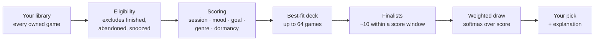
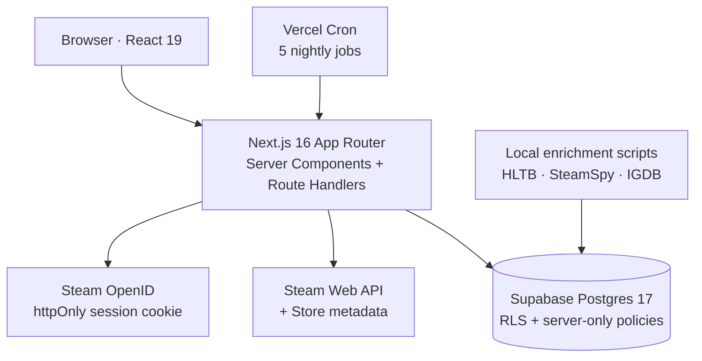

# VaultShuffle

**[vaultshuffle.com](https://www.vaultshuffle.com)** — a Steam backlog companion that decides what you should play tonight, and explains why it chose it.

Most players own far more games than they will ever finish. The cost of that is not money, it is the twenty minutes spent scrolling a library before giving up and reopening something familiar. VaultShuffle replaces the scroll with three questions and one considered pick.

Built as a university side project. Live in production, currently serving **627 accounts** across **~327,000 imported library records** and a shared catalogue of **~26,000 games**.

---

## What it does

You answer three questions — how long you have, what headspace you are in, and what you want out of the session. VaultShuffle scores the games you already own against that setup, draws from the strongest matches, and shows you a single game with its reasoning attached.

From there you can **reroll** (optionally saying why, which the system learns from), **pin** the game to track progress against it, **snooze** it, or **launch straight into Steam**.

**Key features**

- **Steam OpenID sign-in** — no password is ever seen or stored. A public profile URL or a full guest mode both work if you would rather not sign in at all.
- **Automatic library import** — playtime, last-played dates, artwork, genres, tags, review scores and store metadata, synced from Steam.
- **Explained picks** — every recommendation carries up to four reasons drawn from session fit, mood, goal, progress and dormancy.
- **Device modes** — filter the whole library to what actually runs on a **Steam Deck**, a **Mac**, or **Linux**, using Valve's Deck compatibility ratings and per-platform support flags.
- **Playtime-aware progress** — pinned games refresh their playtime nightly and track completion against duration estimates.
- **Family library support** — games shared through Steam Families are marked as such, and correctly upgrade in place if you later buy them.
- **Collections, purge and stats** — group games, decide what to abandon, and see what your library actually looks like.
- **Free, with no paid tier.** No card, no trial, no subscription.

---

## How the pick actually works

The draw is deliberately the *last* step, not the whole system. A random spin through an entire library is worthless — the work is in narrowing the field before chance is allowed anywhere near it.


```mermaid
flowchart LR
  Library["Your library<br/>every owned game"] --> Eligible["Eligibility<br/>excludes finished,<br/>abandoned, snoozed"]
  Eligible --> Scored["Scoring<br/>session · mood · goal ·<br/>genre · dormancy"]
  Scored --> Deck["Best-fit deck<br/>up to 64 games"]
  Deck --> Finalists["Finalists<br/>~10 within a score window"]
  Finalists --> Draw["Weighted draw<br/>softmax over score"]
  Draw --> Pick["Your pick<br/>+ explanation"]
```

**Scoring** is proportional rather than absolute: each active term contributes both the points it earned and the points it *could* have earned, and the final match percentage is the ratio between them. This means a match score always answers one question — "how well does this fit what you asked for?" — regardless of how many terms are in play.

Some deliberate design decisions sit inside that:

- **Goals that widen the pool score nothing.** "Surprise Me" and "Something New" act as eligibility filters only. Letting them consume score would dilute a precise session-and-mood match, which is the opposite of what choosing a goal should do.
- **Learned taste reweights but never gates.** A per-user genre preference model is applied *only* in the final softmax, not in the ranking that builds the deck. If it were in the ranking, it would decide which games are allowed to be drawn at all, and the system would quietly collapse into recommending one genre forever.
- **Preferences are shrunk toward a baseline.** Genre scores are compared in log-odds against the user's own overall rate, which is itself shrunk toward a population-wide rate. A brand-new user starts on shared taste rather than on noise, and no single signal can swing the model.
- **Signals decay.** Preference weights use a 60-day half-life inside a 180-day window, so taste from a year ago does not outvote last week.

---

## Architecture


```mermaid
flowchart TB
  Browser["Browser · React 19"] --> Next["Next.js 16 App Router<br/>Server Components + Route Handlers"]
  Next --> Auth["Steam OpenID<br/>httpOnly session cookie"]
  Next --> SteamAPI["Steam Web API<br/>+ Store metadata"]
  Next --> DB[("Supabase Postgres 17<br/>RLS + server-only policies")]
  Cron["Vercel Cron<br/>5 nightly jobs"] --> Next
  Local["Local enrichment scripts<br/>HLTB · SteamSpy · IGDB"] --> DB
```

**Request path.** The app runs on the Next.js App Router with server components doing the data fetching, and a proxy layer handling session routing, rate limiting and abuse protection before a request reaches a route handler.

**Persistence.** Supabase Postgres holds a shared game catalogue and per-user state as separate concerns. User rows reference the catalogue by identity rather than duplicating metadata, so enriching one catalogue row improves the experience for every player who owns that game.

**Background work.** Five nightly Vercel cron jobs stagger through the pipeline: pinned playtime refresh (01:00), user metadata (03:00), catalogue metadata (04:00), Steam community tags (05:00), then the genre-preference learner (06:00) which deliberately runs last so it reads a freshly refreshed catalogue.

**Heavy enrichment runs locally, not in production.** Duration lookup, matching and validation against HowLongToBeat are checkpointed local scripts that produce staged SQL for review before anything is applied. Serverless functions serve stored estimates; they never contact a third-party enrichment API on the request path.

---

## Tech stack

| Layer | Choice |
|---|---|
| Framework | Next.js 16 (App Router), React 19 |
| Language | TypeScript, strict |
| Database | Supabase — PostgreSQL 17, row-level security |
| Hosting | Vercel, with cron-scheduled workers |
| Validation | Zod |
| Analytics | PostHog + Vercel Analytics, behind an explicit consent gate |
| Testing | Node's built-in test runner (unit) + Playwright (end-to-end) |
| Enrichment | Node and Python scripts against Steam, SteamSpy, HowLongToBeat and IGDB |

---

## Engineering notes

A few problems that were more interesting than they first looked, and how they were resolved:

-redo this part

---

## Testing and quality

- **475 unit tests** covering the scoring and draw pipeline, classification rules, duration matching, authentication flows and the nightly workers.
- **Playwright end-to-end tests** for the flows that matter most, including mobile viewports.
- **`npm run check`** runs typecheck, lint, tests and a production build as one gate.
- Lint rules are configured honestly: React Compiler hook findings are warnings with a written explanation of why they are a tracked backlog rather than an accepted state.

```bash
npm run check
```

---

## How this was built 

**The project itself** This project was designed by me and my role has been direction and judgement rather than authorship of every line: deciding what the product should do, choosing how systems should fit together, reading through what was produced, testing it against real usage, and fixing or rejecting the parts that were wrong. When something broke in production, I was the one working out why. A massive portion of the coding was done by Claude and ChatGPT Codex.

**What I have learned.** Reading unfamiliar code critically. Recognising when a solution is actually wrong — the enrichment of data and authentication of users are both cases where the obvious answer would have quietly damaged real users' experience. Working against live data with real people depending on it, where a careless migration is not a theoretical risk. Scoping a feature down until it is achievable.

This started as a text-only Python backlog tracker for a first-year programming project. It grew into a hosted web application because I kept wanting it to do more. The feedback on. My project and others actually wanting to use it has fuelled me to continue with it and make it a tool the steam community deserves.

---

## Status

Live and actively developed. Current work is focused on catalogue metadata coverage — filling tags, genres and store data for the long tail of the ~26,000-game catalogue, and improving how the recommender uses them.

Feedback is genuinely wanted, especially from people whose libraries break it.

- **Live site:** [vaultshuffle.com](https://www.vaultshuffle.com)
- **Contact:** via the [contact form](https://www.vaultshuffle.com/contact) on the site

---

*VaultShuffle is not affiliated with Valve or Steam. Game names, artwork and store links belong to their respective owners.*
