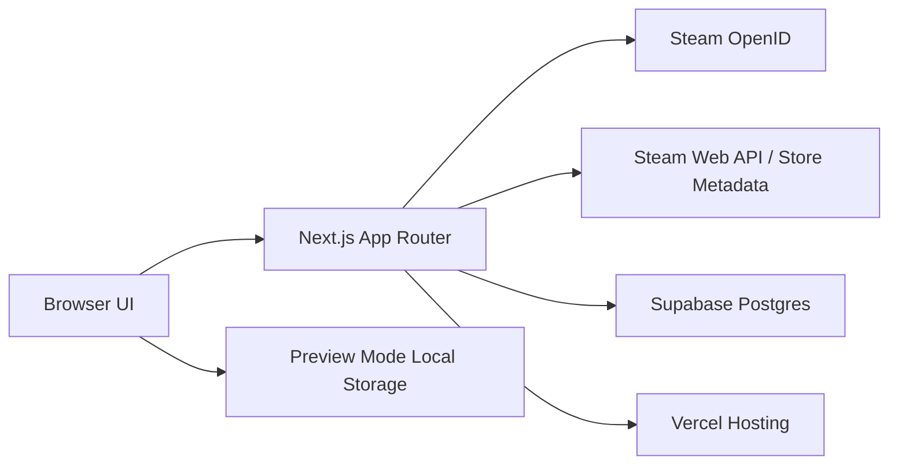

# Vault Shuffle

[Vault Shuffle](https://www.vaultshuffle.com) is a Steam backlog companion that helps players stop staring at a huge library and actually choose something to play.

It started as a first-year Python backlog tracker and has grown into a hosted Next.js app with Steam sign-in, Supabase persistence, Steam metadata sync, and a purpose-built shuffle flow.

## What It Does

- Lets visitors preview the app before signing in.
- Uses Steam OpenID so users can connect without sharing a Steam password.
- Imports a Steam library with playtime, last-played dates, artwork, genres, and ratings where available.
- Stores user-specific game state in Supabase: ownership, playtime, progress, notes, and lifecycle decisions.
- Lets users add individual games from Steam search.
- Filters by status, library source, top-level genre, length, and free-text search.
- Draws random unfinished games from the current visible list through the Vault Shuffle flow.
- Persists the selected visual theme across the site.

## Live Project

- Production: [vaultshuffle.com](https://www.vaultshuffle.com)
- Hosting: Vercel
- Database: Supabase Postgres
- Source control: GitHub

## Architecture


```mermaid
flowchart LR
  Browser["Browser UI"] --> Next["Next.js App Router"]
  Next --> SteamOpenID["Steam OpenID"]
  Next --> SteamAPI["Steam Web API / Store Metadata"]
  Next --> Supabase["Supabase Postgres"]
  Next --> Vercel["Vercel Hosting"]
  Browser --> LocalStorage["Preview Mode Local Storage"]
```

## Data Model

Production uses the V2 private PostgreSQL schemas in Virginia. V1 has been deleted.

- `app.accounts` and `app.sessions`: stable account identities and existing session cookies.
- `catalog.games` and related catalogue tables: shared Steam metadata, tags, HLTB durations, human review and regional Store prices.
- `app.library_games`, `app.game_activity` and `app.game_state`: ownership, personal observations and sparse authored decisions, including permanent Blacklist.
- Owner-scoped Collections, Wishlist, Family access and Vault state/history.
- `ops` and `reco`: bounded workers, provider quotas and recommendation state.

See [database architecture](docs/database-architecture.md) and [database operations](docs/v2-cutover-runbook.md). Guest mode uses the public catalogue without creating account/library rows.

## Notable Implementation Details

- **Steam-first identity:** Steam confirms the account; Vault Shuffle never sees Steam passwords.
- **Canonical metadata:** Steam app details are stored once in the catalogue and refreshed in leased batches.
- **Top-level genre filters:** Games can keep detailed genre tags, but filtering is intentionally reduced to broad useful categories.
- **Shared game classification:** status, progress, length, and endless-game logic are centralised so the app and API agree.
- **Hosted environment:** Steam, session and cron secrets plus restricted V2 app/worker connection settings live in Vercel environment variables; ordinary requests do not use the database owner.


Local development is possible with the same variables, but the public project is intended to be reviewed through the live deployment.

## Quality Checks

Run the checks appropriate to a change:

```bash
npm run typecheck
npm run lint
npm test
npm run test:v2
npm run build
```

V2 repository and worker tests include disposable PostgreSQL integration checks. Applied migrations remain immutable; completed migration setup tooling is retired.

## Roadmap

- Polish the Vault Shuffle modal into the main memorable product moment.
- Improve length estimates with a better external source when permitted.
- Continue filling missing Steam genres, artwork, and ratings through cached background sync.
- Add stronger empty, loading, and error states around imports.
- Add lightweight automated checks once the UI settles.

## Ownership

This is a portfolio project by Ben Thatcher. Vault Shuffle is not affiliated with Valve, Steam, or any game publisher. Game names, artwork, store links, and Steam references belong to their respective owners.
